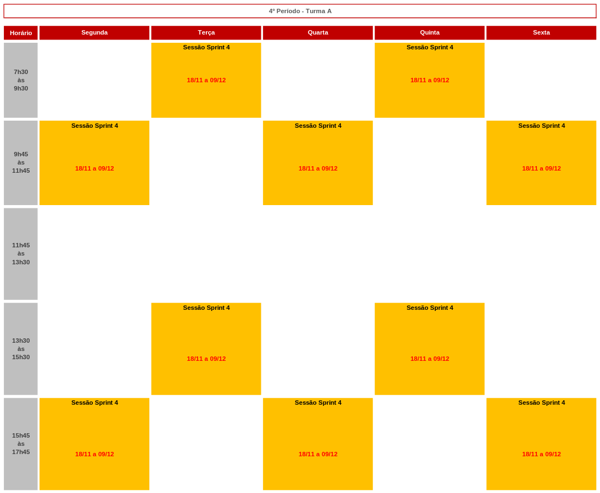

# Agenda 

Esta *sprint session* tem início em 18/11/2024 e termina em 09/12/2024. 

No dia 06/11/2025 das 15:45 às 17:45 a equipe da DASA irá ministrar um curso sobre bioinformática e genômica. A presença de todos os membros da equipe é obrigatória.

A execução da sprint é 100% presencial. No calendário abaixo estão marcados os horários que todos os membros de todas as equipes devem estar presentes. 

Durante os horários que estão em amarelo qualquer professor poderá fazer a chamada em qualquer horário. A presença e participação do desenvolvimento em sala de aula será um dos critérios de avaliação da sprint.

## Calendário de entregas e marcos do projeto

TBD

