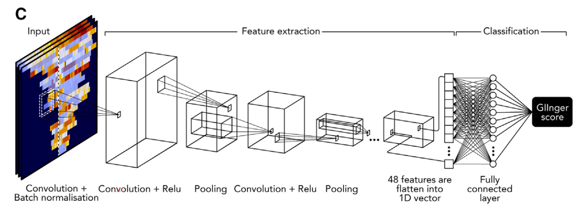

**CNN para detecção de deficiência de recombinação homologa (HRD)**

Felipe Aristides Simao Neto, DASA. 

**Objetivo:**

O objetivo deste projeto é desenvolver uma *Convolutional neural
network* (CNN) para a detecção e análise da Deficiência de Recombinação
Homóloga (HRD) em amostras de câncer a partir de dados de sequenciamento
genético de nova geração (NGS). HRD é uma condição em que a via de
reparo de DNA através da recombinação homóloga está comprometida,
levando à instabilidade genômica e aumentando a susceptibilidade a
determinadas terapias, como os inibidores de PARP. Esta CNN poderá fazer
parte de uma pipeline para identificar o status de HRD em pacientes com
câncer, permitindo estratégias de tratamento personalizadas e melhorando
os resultados clínicos.

**Escopo:**

Desenvolvimento de uma CNN para identificação do status de HRD,
implementada em Python. Dados para treinamento e validação da CNN serão
disponibilizados em formato de heatmaps de duas dimensões mostrando
dados normalizados de cobertura, com cada cromossomo representado por
uma fileira e colunas representando áreas de 3 milhões de bases no
genoma humano (Figura 1B). Como referência, será utilizado o algoritmo
GIInger da SOPHiA genetics publicado no final de 2023 (Figura 1C).

**Figura 1** -- Exemplo de heatmaps e CNN implementadas no GIInger \[1\].

**Entregáveis:**

Uma CNN implementada em Python capaz de calcular o status HRD em
amostras de NGS

**Referencias**

*1.* Pozzorini, Christian et al. **"GIInger predicts homologous recombination deficiency and patient response to PARPi treatment from shallow genomic profiles"** *Cell reports. Medicine* vol. 4,12 (2023): 101344. [doi:10.1016/j.xcrm.2023.101344](doi:10.1016/j.xcrm.2023.101344)
